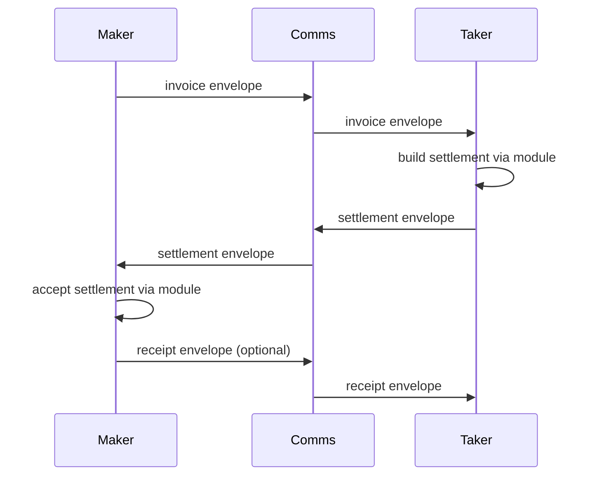
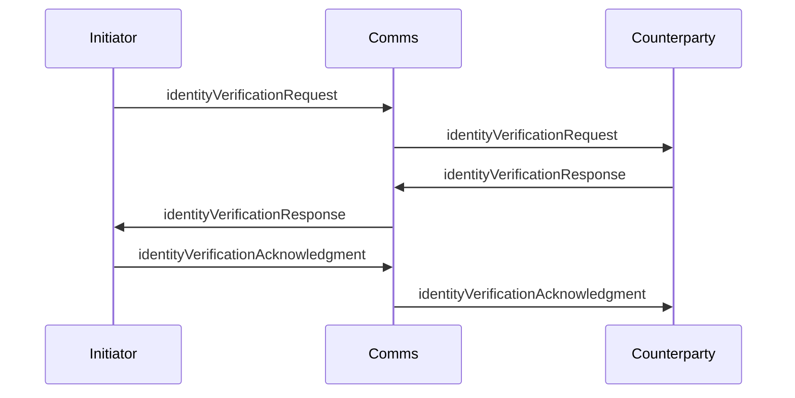

# Remittance Getting Started

This guide introduces the remittance subsystem and shows how to wire a maker and taker together using `RemittanceManager`, `CommsLayer`, and a module such as `Brc29RemittanceModule`. Identity exchange is manager-managed, while certificate verification policy is supplied by the configured `IdentityLayer`.

## Concepts

- **RemittanceManager** orchestrates threads, identity exchange, transport, and receipts.
- **RemittanceModule** builds/accepts settlement artifacts for a specific payment method.
- **CommsLayer** delivers protocol envelopes (store-and-forward and/or live).
- **IdentityLayer** handles certificate requests, responses, and acknowledgment.
- **ThreadHandle** gives you waiters (`waitForState`, `waitForSettlement`, `waitForReceipt`) for streaming or async flows.

## Security and trust boundaries

`CommsLayer` is an authenticated transport boundary. Its `PeerMessage.sender`
must be the cryptographically authenticated peer identity, its body integrity
must be bound to that sender, and it must return only messages addressed to the
requested local recipient and message box. The manager binds those facts to the
thread counterparty and rejects mismatched invoice, settlement, receipt, and
identity payloads; an adapter that supplies an attacker-chosen sender string
cannot be made safe by the manager.

Remittance modules are trusted financial policy adapters. An `accept` result
must mean that the module verified the authenticated sender, invoice/option,
amount, recipient, and concrete payment evidence. The included BRC-29 module
deferred-signs only a wallet transaction containing the requested recipient
script and amount, then independently checks that same selected output before
internalization.

`IdentityLayer.assessReceivedCertificateSufficiency` is an authorization
boundary. It must verify certificate signatures and revocation/freshness, bind
certificate subjects to the authenticated counterparty, and enforce the locally
requested fields, types, and certifiers before returning an acknowledgment.
`thread.identity.acknowledgmentSent` records that local assessment of the peer;
`acknowledgmentReceived` only records that the peer accepted this side's
identity. The convenience `flags.hasIdentified` means that either exchange
direction completed and must not by itself be used as peer authorization.

`stateLoader`, `stateSaver`, event hooks, and the public mutable thread objects
are local administrative capabilities. Keep them in integrity-protected local
storage and trusted code; never hydrate state from an unauthenticated or shared
attacker-writable store. Runtime validation rejects malformed structure,
spoofed financial parties, and unsupported authority flags, but it does not turn
an untrusted persistence service into an authenticated ledger.

Envelope replay is suppressed by authenticated sender plus envelope ID, even
when a transport assigns a new message ID. This does not provide crash-atomic
exactly-once financial effects: the current module, state, and transport APIs
cannot atomically commit a wallet/module side effect, persisted manager state,
and inbox acknowledgment. Modules should make repeated `threadId` processing
idempotent, and production operators should reconcile completed wallet actions
before retrying after an ambiguous process or persistence failure.

## Sequence: Invoice to Receipt



## Sequence: Identity Exchange (when enabled)



When identity is configured as a prerequisite, invoicing or settlement waits
for the local side to assess and acknowledge the counterparty. A peer's
acknowledgment of this side's certificates cannot satisfy that requirement.

## Basic Setup

```ts
import { WalletClient, RemittanceManager, Brc29RemittanceModule } from '@bsv/sdk'
import { MessageBoxClient, MessageBoxAdapter } from '@bsv/message-box-client'

const wallet = new WalletClient('auto', 'localhost')
const messageBoxClient = new MessageBoxClient({
  walletClient: wallet
})
const commsLayer = new MessageBoxAdapter(messageBoxClient)
const brc29Module = new Brc29RemittanceModule()
const manager = new RemittanceManager(
  {
    messageBox: 'direct_payment_test',
    remittanceModules: [brc29Module],
    options: {
      receiptProvided: false, // Disable receipting
      autoIssueReceipt: false,
      invoiceExpirySeconds: 3600
    },
    logger: console
  },
  wallet,
  commsLayer
)

await manager.init()
```

## Sending the Payment (unsolicited settlement)

```ts
const threadHandle = await manager.sendUnsolicitedSettlement(recipient, {
  moduleId: 'brc29.p2pkh',
  option: {
    amountSatoshis: amountSats,
    payee: recipient
  },
  note: `Direct payment test - ${amountSats} sats`
})
```

## Receiving the Payment (unsolicited settlement)

```ts
// Payment will automatically be internalized when threads are synced.
await testSyncThreads(manager)
```

`Brc29RemittanceModule` internalizes a received settlement as a `wallet payment`.
That classification is required: the wallet verifies the BRC-29 derivation and
records the output as spendable managed change in its default balance. Do not
use `basket insertion` for BRC-29 settlement funds; basket insertion is reserved
for application-managed custom outputs and cannot target the default basket.
The module also binds the artifact's claimed amount and output index to the
actual Atomic BEEF transaction and verifies that the output pays the locally
derived recipient P2PKH script. A receipt is therefore not issued merely because
the sender claimed an amount or supplied parseable transaction bytes.

## Event Hooks

Use `onEvent` or the per-event `events` callbacks to react to each step.

```ts
const manager = new RemittanceManager(
  {
    remittanceModules: [new Brc29RemittanceModule()],
    events: {
      onStateChanged: event => console.log('state', event.previous, '->', event.next),
      onSettlementReceived: event => console.log('settlement', event.settlement)
    }
  },
  walletInterface,
  commsLayer
)
```

## State Machine and Auditing

Threads follow the `RemittanceThreadState` state machine, and every transition is recorded in `thread.stateLog`.
Use `REMITTANCE_STATE_TRANSITIONS` to validate transitions or to build a visualizer.

```ts
const thread = manager.getThreadOrThrow(threadId)
console.log(thread.state)
console.log(thread.stateLog)
```

## Live / Streaming Mode

If your `CommsLayer` supports `listenForLiveMessages`, call:

```ts
await manager.startListening()
```

This keeps state current while you use `ThreadHandle.waitForState` to await transitions.
